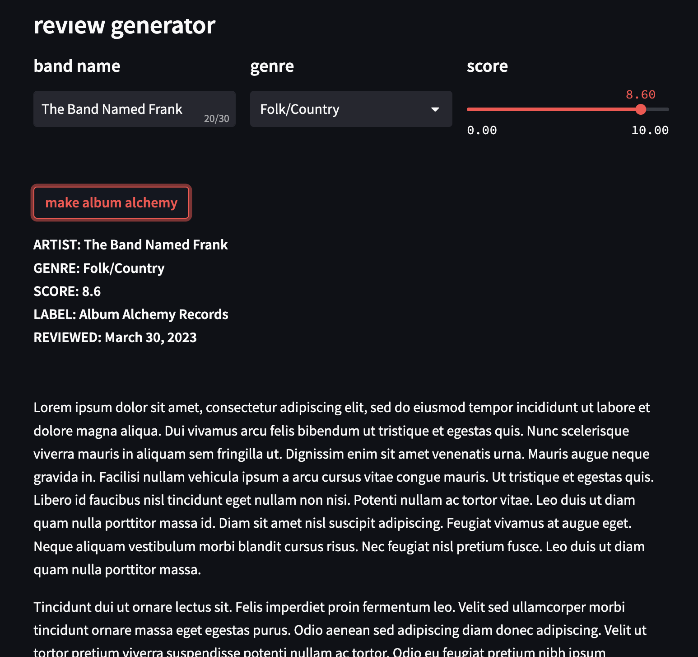

# Welcome to Album Alchemy
[](https://0-kbo-album-alchemy-capstone-app-0a12n5.streamlit.app/)


[Image generated using Stable Diffusion]

Music reviews / music blogs are both fun to read and at times pretentious/snotty and nonsensical, see grandiloquence.  We think it would be fun to create an interactive tool that produces equally nonsensical reviews about user-entered fictional albums. 

Using [OpenAI's GPT-3](https://openai.com/blog/chatgpt) and prompt engineering with the help of [this dataset](https://components.one/datasets/pitchfork-reviews-dataset) created by Andrew Thompson we were able to generate [Pitchfork](https://pitchfork.com/reviews/albums/)-style album reviews for a band name of your choosing.

Our project was partly inspired by [this project](https://components.one/generators/pitchfork/) by Jules Becker at Components.  Her's is a fine-tuned GPT-2 model that generates text from a Pitchfork database.  We sought to improve on this idea by: 
   1. Offering end-users the option of choosing their own band name and personalizing the review to that band
   2. Using prompt engineering instead of fine-tuning to produce stronger reviews
   3. Use GPT-3 instead of GPT-2


## Getting Started

#### Clone Repository

To get a copy of our project running on your local machine, simply run the git clone command

```
git clone https://github.com/tcharroh/album-alchemy.git
cd album-alchemy
```

#### Install Requirements

Before attempting to run anything be sure to run requirements.txt and install all dependencies

```
pip install -r requirements.txt
```
#### Get the Data

```
gdown 1qRJl9d7exNMY_8vNDL4199ZOXGqhUU4a
```

#### Run the App

To run your own version of the Streamlit app, click [here](https://0-kbo-album-alchemy-capstone-app-0a12n5.streamlit.app/)

If you want to run your own local version run command

```
streamlit run appname.py
```

And if you want to deploy your own version, follow these [instructions](https://docs.streamlit.io/streamlit-community-cloud/get-started/deploy-an-app)

## Model Output

#### Sample 



### Evaluation

To ensure that our model does what we are claiming, we have included a few evaluation metrics.

#### Perplexity

How surprised are we to see these words given GPT-3's training data?  Luckily GPT-3 gives us the likelihood of each word it generates.

#### Degree of Memorization

How many 7-grams are present in the generated output that are also present in GPT-3's training data.  For this exercise, we assume that all of the Pitchfork reviews present in the dataset were also used in the training of GPT-3.  To learn more about the training of GPT-3, [see here](https://www.springboard.com/blog/data-science/machine-learning-gpt-3-open-ai/#:~:text=Common%20Crawl%20corpus%20contains%20petabytes%20of%20data%20collected%20over%208%20years%20of%20web%20crawling.%20The%20corpus%20contains%20raw%20web%20page%20data%2C%20metadata%20extracts%20and%20text%20extracts%20with%20light%20filtering.).

#### Humanness

We ask GPT-3 whether a human has written the review just generated by GPT-3 and with what probability it believes in its answer.

#### Cosine Similarity

A comparison using cosine similarity between a review generated by our model and a real Pitchfork review of the same band name, genre, and score.

### Further Work

Our original plan was to fold in a Stable Diffusion model that would use our generated album review to generate album artwork for our fictional band.  Due to computing and time limitations, we decided to scrap that aspect of this project and focus our efforts on the text generation. 

##### Thanks for checking out our project and playing along!
##### - The Album Alchemy Team
